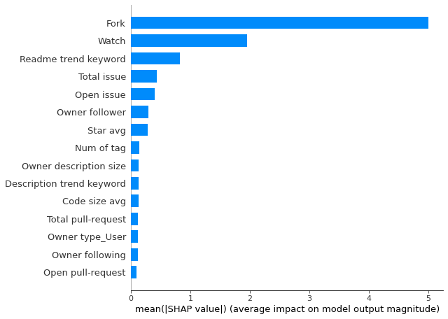
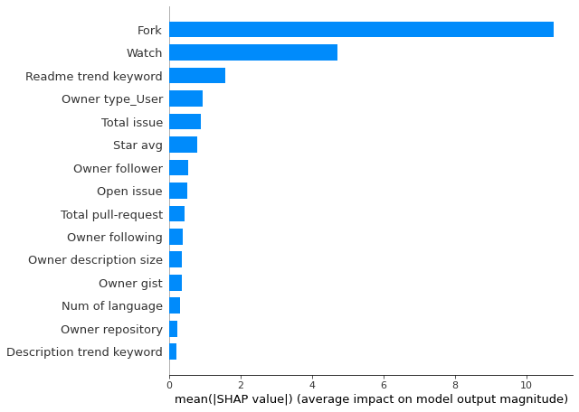
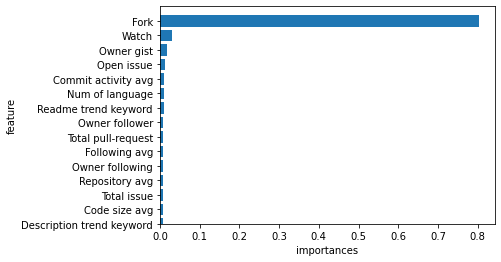
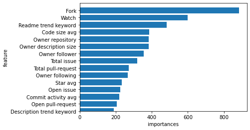

# Popular Repository Prediction based ML
This repository implement a machine learning model that predicts the popular repository.

<br>
 
## About this project
In this project, I use machine learning models that classify popular GitHub repositories. 
We collect 28 indicators corresponding to three categories of repository, owner, and contributor, and then use seven machine learning classification models and compare their respective performances.

<br>
I will upload my paper soon and , I will also refactoring code.

There are several comparison models, but only the main model is uploaded.
<br>

<br>

---

## Architecture

###  Dataset
Collect 9780 "Deep Learning" related repositories registered in 2020

Collect up to 5 contributor information in order of contribution per repository

Collect using [Github-Crawler](https://github.com/ByutMean/Github-Crawler).


<br>

### Model
Using 7 models
- Logistic Regression
- Disicion Tree
- RandomForest
- SVM
- XGBoost
- GBM
- LightGBM


### Feature
- Repository
    - Fork
    - Watch
    - Open issue
    - Total issue
    - Open pull-request
    - Total pull-request
    - Num of tag
    - Num of language
    - Num of contributor
    - Readme trend keyword
    - Description trend keyword
    - Tag trend keyword
    
    <br>

- Owner
    - Owner repository
    - Owner follower
    - Owner following
    - Owner gist
    - Owner type
    - Owner description size

<br>

- Contributor
    - Influence
    - Code size avg
    - Star avg   
    - Repository avg
    - Commit activity avg
    - Following avg
    - Follower avg
    - Gist avg
    - Description size avg
    - Commit avg


---


## Evaluation
|                     | Accuracy | Precision | Recall | F1     |
| ------------------- | -------- | --------- | ------ | ------ |
| Logistic Regression | 0.9903   | 0.6964    | 0.9512 | 0.8041 |
| DecisionTree        | 0.9918   | 0.7907    | 0.8293 | 0.8095 |
| RandomForest        | 0.9923   | 0.7500    | 0.9512 | 0.8387 |
| SVM                 | 0.9893   | 0.6786    | 0.9268 | 0.7835 |
| XGBoost             | 0.9949   | 0.8444    | 0.9268 | 0.8837 |
| GBM                 | 0.9944   | 0.8947    | 0.8293 | 0.8608 |
| LightGBM            | 0.9949   | 0.8605    | 0.9024 | 0.8810 |


---

## Feature importance
Feature importance was confirmed for two models with excellent performance, XGBoost and LightGBM.

### SHAP

XGB 



<br>

LightGBM



### Sklearn 

XGB



<br>

LightGBM


<br>


## Key file

```github_ML``` - It contains all the processes of pre-processing data, implementing machine learning models, and checking the Feature importance. It is necessary to refactoring.

---

## Configuration
```
python == 3.7
scikit-learn 
numpy
pandas
SHAP
```